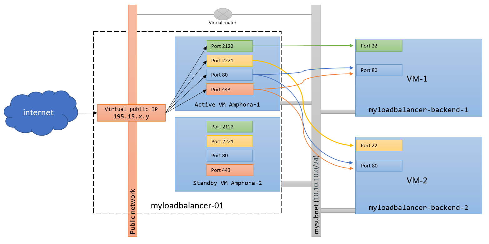

###### [_↩ Back to `main` branch_](https://github.com/cuongpiger/openstack)

<hr>

###### References
- [https://docs.infomaniak.cloud/documentation/06.high-availability/010.load-balancers](https://docs.infomaniak.cloud/documentation/06.high-availability/010.load-balancers/)

<hr>

# Load Balancers (Octavia)
- Load Balancing as a Service (LBaaS) offers load balancing relying on virtual IPs. For the OpenStack platform, LB (load balancing) is provided to users as a service that provides users with on-demand, ready access to configurable business load balancing scenarios, known as Load Balancing as a service.

- This section present a full use case, other examples are available on the [official documentation](https://docs.openstack.org/octavia/latest/user/guides/basic-cookbook.html).

- **Basic object concepts**:
  |#|Object|Description|
  |-|-|-|
  |1|**loadbalancer**|The root object of the load balancing service, on which the user defines, configures, and operates load balancing. _(Technically, loadbalancers are based on haproxy + VRRP)_.|
  |2|**VIP**|The IP address associated with loadbalancer.| 
  |3|**Listener**|Listener belongs to a loadbalancer, the user can configure the type of external access to the VIP (e.g. protocols, ports). _(Technically, it corresponds to the haproxy listen section)_.|
  |4|**Pool**|Pool belongs to a listener and correponds to the configuration of the backend. _(Technically, this is the bakend section of haproxy)_.|
  |5|**Member**|Members belong to a pool and are real virtual machine IPs. _(Technically, corresponds to the lines starting with `server` of the backend section in `haproxy`)_.|
  |6|**Health Monitor**|Belong to a Pool and periodically perform health checks on Member(s) of the Pool. _(Technically, corresponds to check parameters of the backend section in haproxy)_.|
  |7|**L7 Policy**|A seven-tier forwarding policy that describes the action of packet forwarding (e.g. Forward to Pool, forward to URL, refuse to forward).|
  |8|**L7 Rule**|A seven-tier forwarding rule, under which L7 Policy describes the matching domain for packet forwarding (e.g. Forward to all Members in Pool that have started with webserver).|

# Basic example : 2 virtual machines on a private network + 1 loadbalancer with a public IP



- The load balancer will also be used to access the 2 backend virtual machines via SSH
- Steps:
    - **Step 1**: create 1 private network + 1 private subnet
    - **Step 2**: create 2 virtual machines on a private network which will be our HTTP backend
    - **Step 3**: create 1 loadbalancer with a public IP in front of the 2 virtual machines
    - **Step 4**: Configure the loadbalancer
    - **Step 5**: configure a basic HTTP server
    - **Step 6**: Health monitor
    - **Step 7**: Add TLS termination

## Step 1: create 1 private network + 1 private subnet
```bash=
openstack network create mynetwork
```
  > ```bash=
  > root@ENG-DEV-OPS-01:/home/cuongdm3# openstack network create mynetwork
  > +---------------------------+--------------------------------------+
  > | Field                     | Value                                |
  > +---------------------------+--------------------------------------+
  > | admin_state_up            | UP                                   |
  > | availability_zone_hints   |                                      |
  > | availability_zones        |                                      |
  > | created_at                | 2023-12-25T05:42:15Z                 |
  > | description               |                                      |
  > | dns_domain                | None                                 |
  > | id                        | f5bf1a47-9267-4db0-8b58-49afd846fae8 |
  > | ipv4_address_scope        | None                                 |
  > | ipv6_address_scope        | None                                 |
  > | is_default                | False                                |
  > | is_vlan_transparent       | None                                 |
  > | mtu                       | 1450                                 |
  > | name                      | mynetwork                            |
  > | port_security_enabled     | True                                 |
  > | project_id                | c430b410b86f412194999216f04ec39a     |
  > | provider:network_type     | vxlan                                |
  > | provider:physical_network | None                                 |
  > | provider:segmentation_id  | 4                                    |
  > | qos_policy_id             | None                                 |
  > | revision_number           | 1                                    |
  > | router:external           | Internal                             |
  > | segments                  | None                                 |
  > | shared                    | False                                |
  > | status                    | ACTIVE                               |
  > | subnets                   |                                      |
  > | tags                      |                                      |
  > | tenant_id                 | c430b410b86f412194999216f04ec39a     |
  > | updated_at                | 2023-12-25T05:42:15Z                 |
  > +---------------------------+--------------------------------------+
  > ```

```bash=
openstack subnet create mysubnet --network mynetwork --dhcp --subnet-range 10.10.10.0/24 \
  --dns-nameserver 8.8.8.8 --dns-nameserver 8.8.4.4 \
  --allocation-pool start=10.10.10.100,end=10.10.10.200
```
  > ```bash=
  > root@ENG-DEV-OPS-01:/home/cuongdm3# openstack subnet create mysubnet --network mynetwork --dhcp --subnet-range 10.10.10.0/24 --dns-nameserver 8.8.8.8 --dns-nameserver 8.8.4.4 --allocation-pool start=10.10.10.100,end=10.10.10.200
  > +----------------------+--------------------------------------+
  > | Field                | Value                                |
  > +----------------------+--------------------------------------+
  > | allocation_pools     | 10.10.10.100-10.10.10.200            |
  > | cidr                 | 10.10.10.0/24                        |
  > | created_at           | 2023-12-25T05:43:56Z                 |
  > | description          |                                      |
  > | dns_nameservers      | 8.8.4.4, 8.8.8.8                     |
  > | dns_publish_fixed_ip | None                                 |
  > | enable_dhcp          | True                                 |
  > | gateway_ip           | 10.10.10.1                           |
  > | host_routes          |                                      |
  > | id                   | cdae1465-0666-42f3-b060-9fbaa02d38a3 |
  > | ip_version           | 4                                    |
  > | ipv6_address_mode    | None                                 |
  > | ipv6_ra_mode         | None                                 |
  > | name                 | mysubnet                             |
  > | network_id           | f5bf1a47-9267-4db0-8b58-49afd846fae8 |
  > | project_id           | c430b410b86f412194999216f04ec39a     |
  > | revision_number      | 0                                    |
  > | segment_id           | None                                 |
  > | service_types        |                                      |
  > | subnetpool_id        | None                                 |
  > | tags                 |                                      |
  > | updated_at           | 2023-12-25T05:43:56Z                 |
  > +----------------------+--------------------------------------+
  > ```

## Step 2: create 2 virtual machines on a private network
```bash=
openstack server create --key-name cuongdm3-keypair --flavor ds4G --image 6d4c5062-bf64-4881-99a2-207573893faf --network mynetwork myloadbalancer-backend-1
```
  > ```bash=
  > root@ENG-DEV-OPS-01:/home/cuongdm3# openstack server create --key-name cuongdm3-keypair --flavor ds4G --image 6d4c5062-bf64-4881-99a2-207573893faf --network mynetwork myloadbalancer-backend-1
  > +-------------------------------------+-----------------------------------------------------------+
  > | Field                               | Value                                                     |
  > +-------------------------------------+-----------------------------------------------------------+
  > | OS-DCF:diskConfig                   | MANUAL                                                    |
  > | OS-EXT-AZ:availability_zone         |                                                           |
  > | OS-EXT-SRV-ATTR:host                | None                                                      |
  > | OS-EXT-SRV-ATTR:hypervisor_hostname | None                                                      |
  > | OS-EXT-SRV-ATTR:instance_name       |                                                           |
  > | OS-EXT-STS:power_state              | NOSTATE                                                   |
  > | OS-EXT-STS:task_state               | scheduling                                                |
  > | OS-EXT-STS:vm_state                 | building                                                  |
  > | OS-SRV-USG:launched_at              | None                                                      |
  > | OS-SRV-USG:terminated_at            | None                                                      |
  > | accessIPv4                          |                                                           |
  > | accessIPv6                          |                                                           |
  > | addresses                           |                                                           |
  > | adminPass                           | ts4e8crgW47s                                              |
  > | config_drive                        |                                                           |
  > | created                             | 2023-12-25T05:45:52Z                                      |
  > | flavor                              | ds4G (d4)                                                 |
  > | hostId                              |                                                           |
  > | id                                  | b2830eda-a60a-4b4e-9b54-9829956afbe1                      |
  > | image                               | Ubuntu-Jammy_amd64 (6d4c5062-bf64-4881-99a2-207573893faf) |
  > | key_name                            | cuongdm3-keypair                                          |
  > | name                                | myloadbalancer-backend-1                                  |
  > | progress                            | 0                                                         |
  > | project_id                          | c430b410b86f412194999216f04ec39a                          |
  > | properties                          |                                                           |
  > | security_groups                     | name='default'                                            |
  > | status                              | BUILD                                                     |
  > | updated                             | 2023-12-25T05:45:52Z                                      |
  > | user_id                             | f2d17b43055643b285864642b07ae854                          |
  > | volumes_attached                    |                                                           |
  > +-------------------------------------+-----------------------------------------------------------+
  > ```

```bash=
openstack server create --key-name cuongdm3-keypair --flavor ds4G --image 6d4c5062-bf64-4881-99a2-207573893faf --network mynetwork myloadbalancer-backend-2
```
  > ```bash=
  > root@ENG-DEV-OPS-01:/home/cuongdm3# openstack server create --key-name cuongdm3-keypair --flavor ds4G --image 6d4c5062-bf64-4881-99a2-207573893faf --network mynetwork myloadbalancer-backend-2
  > +-------------------------------------+-----------------------------------------------------------+
  > | Field                               | Value                                                     |
  > +-------------------------------------+-----------------------------------------------------------+
  > | OS-DCF:diskConfig                   | MANUAL                                                    |
  > | OS-EXT-AZ:availability_zone         |                                                           |
  > | OS-EXT-SRV-ATTR:host                | None                                                      |
  > | OS-EXT-SRV-ATTR:hypervisor_hostname | None                                                      |
  > | OS-EXT-SRV-ATTR:instance_name       |                                                           |
  > | OS-EXT-STS:power_state              | NOSTATE                                                   |
  > | OS-EXT-STS:task_state               | scheduling                                                |
  > | OS-EXT-STS:vm_state                 | building                                                  |
  > | OS-SRV-USG:launched_at              | None                                                      |
  > | OS-SRV-USG:terminated_at            | None                                                      |
  > | accessIPv4                          |                                                           |
  > | accessIPv6                          |                                                           |
  > | addresses                           |                                                           |
  > | adminPass                           | 94gw7FoLceCu                                              |
  > | config_drive                        |                                                           |
  > | created                             | 2023-12-25T05:46:46Z                                      |
  > | flavor                              | ds4G (d4)                                                 |
  > | hostId                              |                                                           |
  > | id                                  | 9b74d342-47ae-4881-b22c-4a9c30e9b344                      |
  > | image                               | Ubuntu-Jammy_amd64 (6d4c5062-bf64-4881-99a2-207573893faf) |
  > | key_name                            | cuongdm3-keypair                                          |
  > | name                                | myloadbalancer-backend-2                                  |
  > | progress                            | 0                                                         |
  > | project_id                          | c430b410b86f412194999216f04ec39a                          |
  > | properties                          |                                                           |
  > | security_groups                     | name='default'                                            |
  > | status                              | BUILD                                                     |
  > | updated                             | 2023-12-25T05:46:46Z                                      |
  > | user_id                             | f2d17b43055643b285864642b07ae854                          |
  > | volumes_attached                    |                                                           |
  > +-------------------------------------+-----------------------------------------------------------+
  > ```

```bash=
openstack server list
```
  > ```bash=
  > root@ENG-DEV-OPS-01:/home/cuongdm3# openstack server list
  > +--------------------------------------+------------------------------------------------+--------+----------------------------------------------------+--------------------------+--------+
  > | ID                                   | Name                                           | Status | Networks                                           | Image                    | Flavor |
  > +--------------------------------------+------------------------------------------------+--------+----------------------------------------------------+--------------------------+--------+
  > | 9b74d342-47ae-4881-b22c-4a9c30e9b344 | myloadbalancer-backend-2                       | BUILD  |                                                    | Ubuntu-Jammy_amd64       | ds4G   |
  > | b2830eda-a60a-4b4e-9b54-9829956afbe1 | myloadbalancer-backend-1                       | ACTIVE | mynetwork=10.10.10.167                             | Ubuntu-Jammy_amd64       | ds4G   |
  > | 9d3c78a6-c5f3-4a58-9a43-57d8f295a843 | lab-jared-sachez-v1-29-0-vqvdirguinzy-node-0   | ACTIVE | LAB-jared-sachez-v1.29.0=10.0.0.86, 49.213.90.198  | N/A (booted from volume) | ds4G   |
  > | cdcc5084-2e01-4b63-9c85-509c0308e760 | lab-jared-sachez-v1-29-0-vqvdirguinzy-master-0 | ACTIVE | LAB-jared-sachez-v1.29.0=10.0.0.239, 49.213.90.203 | N/A (booted from volume) | ds4G   |
  > +--------------------------------------+------------------------------------------------+--------+----------------------------------------------------+--------------------------+--------+
  > ```

- We create a security group to open the ports SSH and HTTP (22 and 80)
```bash=
openstack security group create myloadbalancer-backend-securitygroup
```
  > ```bash=
  > root@ENG-DEV-OPS-01:/home/cuongdm3# openstack security group create myloadbalancer-backend-securitygroup
  > +-----------------+-------------------------------------------------------------------------------------------------------------------------------------------------------+
  > | Field           | Value                                                                                                                                                 |
  > +-----------------+-------------------------------------------------------------------------------------------------------------------------------------------------------+
  > | created_at      | 2023-12-25T05:47:26Z                                                                                                                                  |
  > | description     | myloadbalancer-backend-securitygroup                                                                                                                  |
  > | id              | be869071-ebf6-45ff-aa2f-984610383d69                                                                                                                  |
  > | name            | myloadbalancer-backend-securitygroup                                                                                                                  |
  > | project_id      | c430b410b86f412194999216f04ec39a                                                                                                                      |
  > | revision_number | 1                                                                                                                                                     |
  > | rules           | created_at='2023-12-25T05:47:26Z', direction='egress', ethertype='IPv6', id='0b239f23-2077-41f3-805c-78f91733b2c4', updated_at='2023-12-25T05:47:26Z' |
  > |                 | created_at='2023-12-25T05:47:26Z', direction='egress', ethertype='IPv4', id='88a28e75-bd0a-42ba-9187-cfcdad4a151d', updated_at='2023-12-25T05:47:26Z' |
  > | stateful        | None                                                                                                                                                  |
  > | tags            | []                                                                                                                                                    |
  > | updated_at      | 2023-12-25T05:47:26Z                                                                                                                                  |
  > +-----------------+-------------------------------------------------------------------------------------------------------------------------------------------------------+
  > ```

```bash=
openstack security group rule create --ingress --protocol tcp --dst-port 22 --ethertype IPv4 myloadbalancer-backend-securitygroup
```
  > ```bash=
  > root@ENG-DEV-OPS-01:/home/cuongdm3# openstack security group rule create --ingress --protocol tcp --dst-port 22 --ethertype IPv4 myloadbalancer-backend-securitygroup
  > +-------------------------+--------------------------------------+
  > | Field                   | Value                                |
  > +-------------------------+--------------------------------------+
  > | created_at              | 2023-12-25T05:48:15Z                 |
  > | description             |                                      |
  > | direction               | ingress                              |
  > | ether_type              | IPv4                                 |
  > | id                      | f43c1ca2-77a5-4a5c-94fb-1ca651a4d886 |
  > | name                    | None                                 |
  > | port_range_max          | 22                                   |
  > | port_range_min          | 22                                   |
  > | project_id              | c430b410b86f412194999216f04ec39a     |
  > | protocol                | tcp                                  |
  > | remote_address_group_id | None                                 |
  > | remote_group_id         | None                                 |
  > | remote_ip_prefix        | 0.0.0.0/0                            |
  > | revision_number         | 0                                    |
  > | security_group_id       | be869071-ebf6-45ff-aa2f-984610383d69 |
  > | tags                    | []                                   |
  > | updated_at              | 2023-12-25T05:48:15Z                 |
  > +-------------------------+--------------------------------------+
  > ```

```bash=
openstack security group rule create --ingress --protocol tcp --dst-port 80 --ethertype IPv4 myloadbalancer-backend-securitygroup
```
  > ```bash=
  > root@ENG-DEV-OPS-01:/home/cuongdm3# openstack security group rule create --ingress --protocol tcp --dst-port 80 --ethertype IPv4 myloadbalancer-backend-securitygroup
  > +-------------------------+--------------------------------------+
  > | Field                   | Value                                |
  > +-------------------------+--------------------------------------+
  > | created_at              | 2023-12-25T05:48:43Z                 |
  > | description             |                                      |
  > | direction               | ingress                              |
  > | ether_type              | IPv4                                 |
  > | id                      | 6c8ea00c-4aa1-438e-b9cf-b3c125774ca5 |
  > | name                    | None                                 |
  > | port_range_max          | 80                                   |
  > | port_range_min          | 80                                   |
  > | project_id              | c430b410b86f412194999216f04ec39a     |
  > | protocol                | tcp                                  |
  > | remote_address_group_id | None                                 |
  > | remote_group_id         | None                                 |
  > | remote_ip_prefix        | 0.0.0.0/0                            |
  > | revision_number         | 0                                    |
  > | security_group_id       | be869071-ebf6-45ff-aa2f-984610383d69 |
  > | tags                    | []                                   |
  > | updated_at              | 2023-12-25T05:48:43Z                 |
  > +-------------------------+--------------------------------------+
  > ```