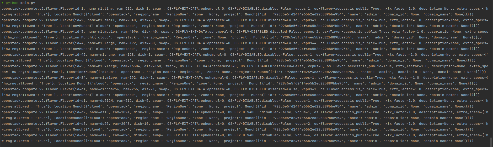

# 1. Env
* Python 3.10.0
* Virtual env: conda

# 2. Detail
* You must run the **DevStack** successfully before running this project, you can follow this guideline to run **OpenStack** using **DevStack**: [https://github.com/cuongpiger/openstack/tree/lab/launch-devstack](https://github.com/cuongpiger/openstack/tree/lab/launch-devstack)

* Login to **OpenStack** dashboard by the IP address of your OpenStack service, for example: [http://192.168.239.196](http://192.168.239.196)
  * **Note**: It does not work on your machine, because this is my personal configuration.
* After running **OpenStack** successfully, access this url: [http://192.168.239.196/dashboard/project/api_access/](http://192.168.239.196/dashboard/project/api_access/) to download `clouds.yaml` configuration environment file.
  

* Place the `clouds.yaml` file in the root directory of your project, in my scenario, it is in the `resources` directory.

* The `clouds.yaml` file does not include the `password` field because of security reasons, so you need to add the `password` field to the `clouds.yaml` file, look at the file `clouds.yaml` in the `resources` directory for more details.

* Run the `main.py` file to test the **OpenStack** service, this image below shows the flavors inside OpenStack:
  