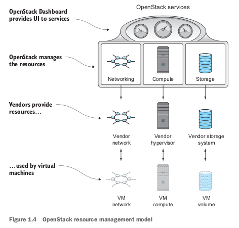
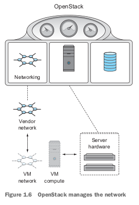
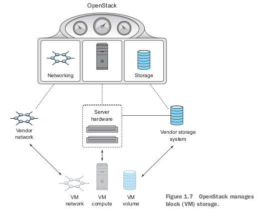

# Chapter 01. Introducing OpenStack

## 1.1. What is OpenStack
## 1.2. Understanding cloud computing and OpenStack
* This book focuses on deploying **private enterprise clouds** using OpenStack.
* It will describe private clouds as pools of infrastructure resources (VMs, storage, and so on), also known as **infrastructure as a service** (IaaS).

### 1.2.1. Abstraction and the OpenStack API
* OpenStack abstracts and provides a common API for controlling hardware and software resources.
* The framework provides two important things:
  * Abstraction of hardware and software resources, this is accomplished by managing resources through OpenStack, not directly using the vendor component.
    * The drawback is that not all vendor features are suported by OpenStack, but common required features are.
  * A common API across resources, which allows for complete orchestration of the connected components.

## 1.3. Relating OpenStack to the computational resources it controls
### 1.3.1. OpenStack and hypervisors

* A **hypervisor** is **virtual machine monitor** (VMM) is software that manages the emulation of physical hardware for virtual machines.
* OpenStack is **not** a hypervisor, but it does control hypervisors operations.
* Many hypervisors are supported under the OpenStack framework, including XenServer/XCP, KVM, QEMU, LXC, ESXi, Hyper-V, BareMetal,...
* The image 1.5. shows OpenStack managing resources that are virtualized by a hypervisor on physical hardware in an OpenStack cluster.

### 1.3.2. OpenStack and network services
* OpenStack is not a **virtual switch**, but it does manage several physical and virtual network devices and virtual overlay networks.
* OpenStack directly provides network services like DHCP, routing, and so on.
   

### 1.3.3. OpenStack and storage
* OpenStack is not a **storage system**, it does not physically provide the storage used by virtual machines.
* If you have ever used a file share (NFS, CIFS,...), you were using **file-based** storage. This type of storage is easy for humans to navigate and computers to access, but it is generally and an abstraction of another type of storage - **block storage**.
* There is another type of storage called **object storage**. This type of storage is designed to store large amounts of data, and is generally accessed through a REST API. It's common to use object storage for storing backups, logs, and other data that is not accessed frequently.
#### 1.3.3.1. Block storage
* OpenStack can manage many vendor-provided storage solution, including solutions from Ceph, Dell, EMC, HP, IBM, NetApp, and others.

#### 1.3.3.2. Object storage
* Obj
ect storage does not have to be in a single location.
* This type of storage can be used to store volume backups, and it is also common to use object storage for large amounts of data that can be easily isolated into binary objects.
* The traditional use case for object storage is to store data that will be accessed by an application, such as a document or file that will be used by an application on a user's behalf. 
* It is common to use object storage as a repository for VM images.
* Object storage might also be used to back up a snapshot of an existing VM for a long-term backup.

## 1.4. Introducing OpenStack components
|Project|Code name|Description|
|-|-|-|
|Compute|Nova|Manages VM resources, including CPU, memory, disk, and network interfaces.|
|Networking|Neutron|Provides resources used by the VM network interface, including IP addressing, routing, and SDN.|
|Object Storage|Swift|Provides object storage, accessible via a RESTful API.|
|Block Storage|Cinder|Provides block storage (traditional disk) to VMs|
|Identity|Ketstone|Manages roles based access control (RBAC) for OpenStack components. Provides authorization services.|
|Image service|Glance|Manages VM disk images. Provides image delivery to VMs and snapshot (backup) services.|
|Dashboard|Horizon|Provides a web-based dashboard for managing/working OpenStack resources.|
|Telemetry|Ceilometer|Provides collection for metering and monitoring OpenStack components.|
|Orchestration|Heat|Provides a template-based cloud application orchestration for OpenStack environments.|
