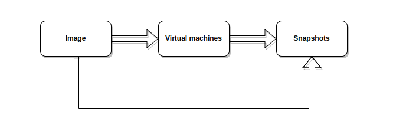
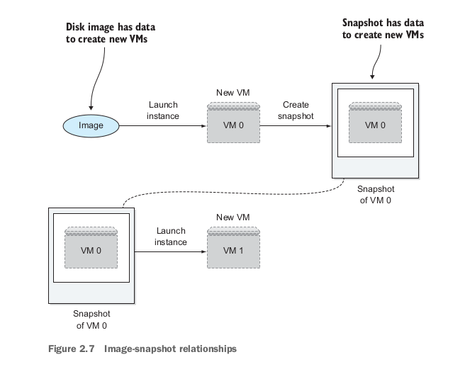

# Chapter 02. Taking an OpenStack test-drive
## Important things to remember
> [`security groups`](#security-groups), [`key pairs`](#key-pairs), [`floating IPs`](#floating-ips), [`images`](#images), [`snapshots`](#snapshots)

* To interact with OpenStack, you use DevStack
* DevStack helps you to deploy a single-node OpenStack cloud without knowing a great deal about OpenStack and without the need for a bunch of hardware.

## 2.1. What is DevStack
* DevStack was created to make the job of deploying OpenStack in **test** and **development** environment quicker, easier.
* DevStack is a collection of documented Bash shell scripts that are used to prepare an environment for configure, and deploy OpenStack.
* But DevStack is not used to deploy an OpenStack production environment.

## 2.2. Deploying DevStack
* Reading the book.

## 2.3. Using the OpenStack Dashboard
### 2.3.1. Overview screen
* Reading the book.

### 2.3.2. Access & Security Screen

###### \#Security groups
* Imagine that you have a VM instance that is **network policy inaccessible (PI)**.
* In this context, PI refers to the inability to access an instace over the network based in some access-limiting network policy, such as a global rule that denies all network access by default.
* In OpenStack, **security groups** defines rules (**access lists**) to describe access (both incomming and outgoing) on the network level.
* A security group can be created for an individual instance, or collections of instances can share the same security group.
* DevStack creates a default security group that contains rules that allow all IPv4 and IPv6 traffic in (ingress) and out (egress) of virtual machine.
* In short, security groups are like personal firewalls for specific groups of instances of VMs.

###### \#Key pairs
* OpenStack provide a feature called **Key Pairs** used to provide secure remote access to instaces.
* A key pair consists of two parts: **a public key** and **a private key**.
  * The public key is used to **encrypt data**.
  * The private key is used to **decrypt data**.
* When you launch an instance in OpenStack, you can specify a key pair that will be associated with that instance. This key pair allows you to securely log-in to the instance using SSH (Secure Shell) from your local machine.
* To create a key pair in OpenStack, you can use CLI, Dashboard, or API.
* It is important to note that the private key should be kept secure, as anyone with access to it can log-in to the associated instance.
* The public key can be shared with others, as it is used only for encrypting data send to the instance.

###### \#Floating IPs
* **Floating IPs** are used to provide a static IP address to an instance, it helps to expose VMs to the Internet.
### 2.3.3. Images & Snapshots screen
###### \#Images
* For Ubuntu images, you can visit this link to download Ubuntu cloud images [https://cloud-images.ubuntu.com/](https://cloud-images.ubuntu.com/).
* an image is a file that contains the complete state of an instance, including the operating system, applications, and any data that was stored on the instance.
* Images are used to create new instances, allowing you to easily replicate an existing setup or create a new one from scratch.
* You can think of images as "VMs waiting to happen" void of user data.

###### \#Snapshots
* **Snapshots** are used to create a backup of an instance. You can think of snapshots as "VMs that have happened" with user data.
* There is a transitive relationship between images and snapshots:
  
  * Image create virtual machines, machines then creating snapshots, so snapshots are created from images.

* So, in OpenStack, images = snapshots + metadata (user data). The image below shows you the relationship between images and snapshots:
  